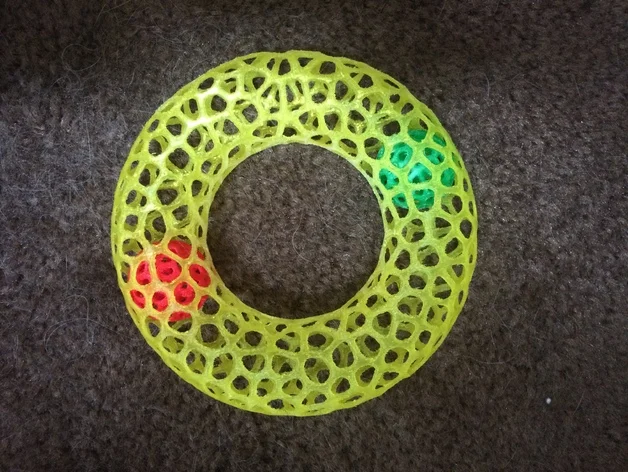
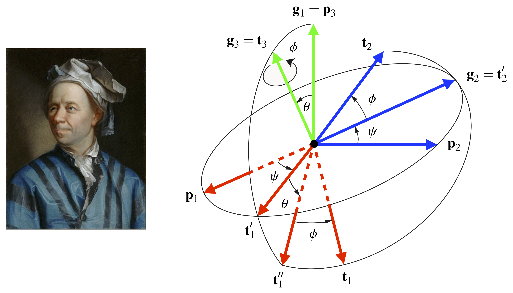

# Arduino Virtual Ball inside a Torus

This small Arduino construction reproduces the machanics of a (single) ball kept inside a torus. By moving the Arduino board itself accross the 6 dimansions, the ball circulates inside.

The behavior is calculated realtime by the processor, based on standard mechanics equations, using moment of inertia.

All calculations are based on Euler angles, in the canonical (first) approach based on the ZXZ axis rotation order: &#x03c8; (psi), &#x03b8; (theta) then &#x03c6; (phi, &#x03d5; in the picture bellow). This picture from [Berkeley University](https://rotations.berkeley.edu/the-euler-angle-parameterization/) explains the used notation.

Few additional notations:
- *l* : the torus radius
- *&#x03b1; (alpha)* : the angle of the ball in the torus referential with the x axis
- *g* : the gravity constant
- *m* : the mass of the ball
- *fr* : the friction factor

When the board is fixed, where xy is the horizantal plane and its z axis points verticaly upward, the only moment is from the gravity force:

&nbsp;&nbsp;&nbsp;&nbsp;

The period of the oscillation of the ball is as bellow. For a 4cm radius verticaly oriented torus, the period is about 0.4 seconds.

&nbsp;&nbsp;&nbsp;&nbsp;

When the board starts to move by a human hand, the board referencial can not be considered galilean anymore. The moment of fictitious forces apply too. First as the referential translates along the 3 axis, the moment of the inertia force applies. As the referential rotates, the 3 new fictitious forces are the Euler force, the Coriolis force and the centrifugal force. The 3 forces are explained [here](https://en.wikipedia.org/wiki/Coriolis_force#Formula).

&nbsp;&nbsp;&nbsp;&nbsp;

A friction force has also been added, it acts inverse to the ball speed.

The moment of the 4 fictitious forces and the friction are equal to:

&nbsp;&nbsp;&nbsp;&nbsp;

So the complete equation is:

&nbsp;&nbsp;&nbsp;&nbsp;

I have calculated all the equations myself, so if you find any error, please contact me!

Thanks to [Ole Eichhorn at Thingiverse](https://www.thingiverse.com/thing:324904) for the picture of the toy.